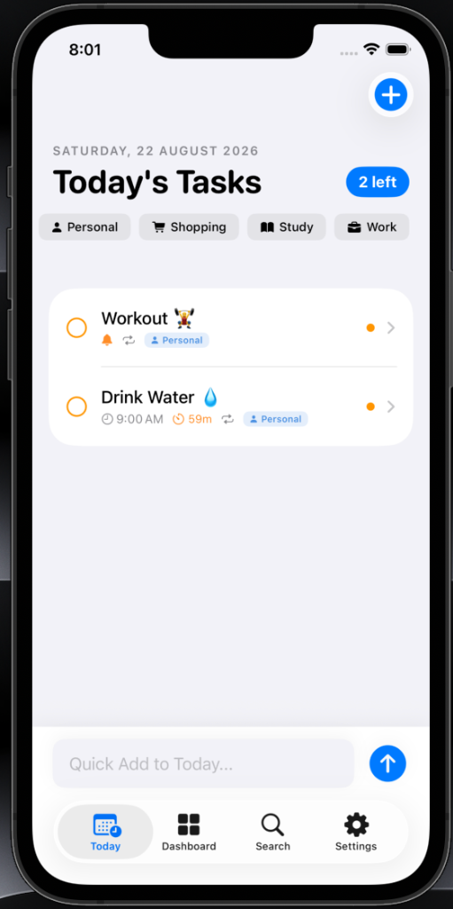
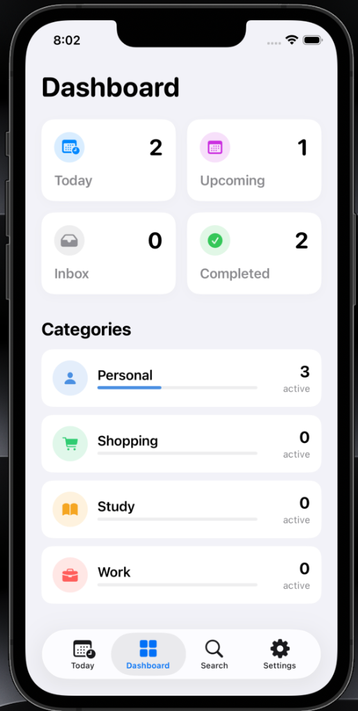
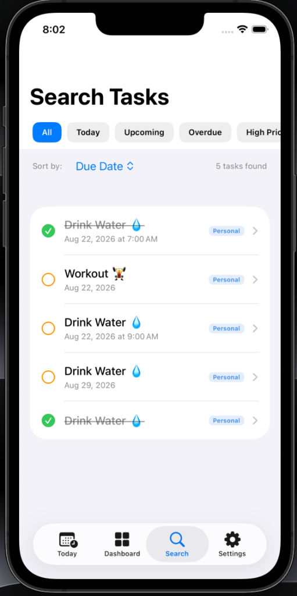
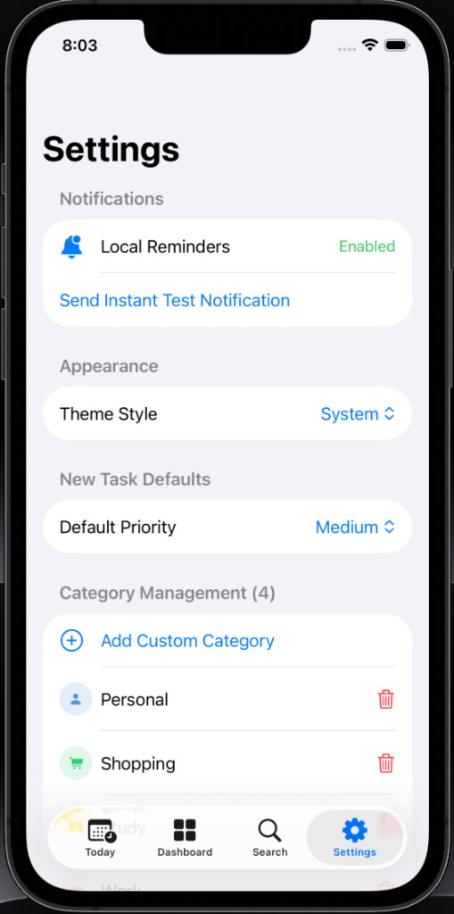

# Daymark 🔔

Daymark is a premium, modern daily task planner for iOS, built with SwiftUI, SwiftData, and the native UserNotifications framework. It helps you schedule your day, manage recurring habits, and track subtask progress with a beautiful, responsive user interface.

## Features

- **SwiftData Persistence**: Offline-first task management and categories database.
- **Categorization & Priorities**: Organize tasks with icons, custom hex colors, and Low/Medium/High priority tags.
- **Subtasks Checklist**: Complete subtasks inline and track completion progress with an animated visual progress bar.
- **Standard Recurrence**: Supports Daily, Weekdays, Weekly, and Monthly recurrence.
- **Interval Reminders (Drink Water & Hydration)**:
  - Set a custom daily window (e.g. 9:00 AM to 9:00 PM).
  - Schedule notifications at regular intervals (e.g. every 15 mins, 30 mins, 45 mins, 1 hour, or 2 hours).
  - Features midnight-wrapping support for night shifts.
- **Dynamic Countdown Tracker**: Task rows display active timer badges showing a live countdown to the next scheduled interval reminder using SwiftUI `TimelineView`.

---

## Screenshots

<p align="center">
  
  
</p>
<p align="center">
  
  
</p>

---

## Tech Stack

- **UI**: SwiftUI (built for iOS 15+)
- **Storage**: SwiftData
- **Notifications**: Local UserNotifications (UNCalendarNotificationTrigger)
- **Architecture**: MVVM with SwiftData `@Model` classes

## How to Install and Run on iPhone

To run Daymark on a physical iPhone, you can choose one of the two methods below.

> [!NOTE]
> **Prerequisite for iOS 16+**: You must enable **Developer Mode** on your iPhone. 
> Go to **Settings > Privacy & Security > Developer Mode**, toggle it ON and restart your device.

---

### Method 1: Sideload the Pre-built IPA (No Mac required)

We automatically build and package Daymark as an unsigned `.ipa` file using GitHub Actions. You can sideload it using your free personal Apple ID:

1. **Download the IPA**:
   - Go to the **Releases** tab on this GitHub repository.
   - Download the latest `Daymark.ipa` from the assets of the latest release.
2. **Install using Sideloadly (Easiest, macOS & Windows)**:
   - Download and install [Sideloadly](https://sideloadly.io/).
   - Connect your iPhone to your computer.
   - Drag and drop `Daymark.ipa` into Sideloadly.
   - Enter your Apple ID and click **Start**.
   - Once complete, open **Settings > General > VPN & Device Management** on your iPhone, select your Apple ID, and trust the certificate.
3. **Install using AltStore (Wireless, macOS & Windows)**:
   - Install [AltStore](https://altstore.io/) on your computer and device.
   - Open AltStore on your iPhone, go to **My Apps**, and tap the **+** icon in the top left.
   - Select the downloaded `Daymark.ipa` and sign in with your Apple ID to install.

*Note: Sideloaded apps using a free Apple ID expire after 7 days, after which they need to be refreshed (AltStore does this automatically over Wi-Fi).*

---

### Method 2: Build from Source using Xcode (Recommended for Mac Users)

Since Daymark is fully open source, the most secure and permanent way to run it is compiling it directly via Xcode:

1. **Clone the repository**:
   ```bash
   git clone https://github.com/Sreyas-J-S/Daymark.git
   ```
2. **Open in Xcode**:
   - Open `Daymark.xcodeproj` in Xcode.
3. **Configure Signing**:
   - Select the root project **Daymark** in the left sidebar.
   - Select the **Signing & Capabilities** tab.
   - Check **Automatically manage signing**.
   - Under **Team**, select your Personal Team (or sign in with your Apple ID).
   - Change the **Bundle Identifier** to a unique value (e.g., `com.yourname.Daymark`).
4. **Run the App**:
   - Connect your iPhone to your Mac via cable.
   - Select your iPhone as the build target at the top of Xcode.
   - Click the **Run** button (or press `Cmd + R`).
   - On your iPhone, trust your personal developer certificate under **Settings > General > VPN & Device Management**.

